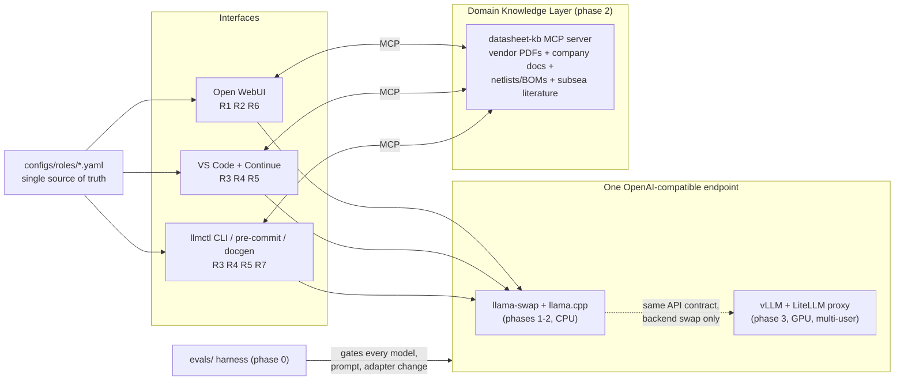

# Implementation Roadmap — Offline Local LLM Stack

Implements the approved
[use-case design](../superpowers/specs/2026-06-12-use-cases-design.md):
eight assistant roles (Turkish documents, coding, review, standards,
EDA, domain Q&A) running fully offline — today single-user on a 64 GB
RAM / 8-core CPU Windows 11 box, later a 5–10 engineer team on an on-prem
GPU server. Everything is phased so the CPU era builds nothing the GPU era
throws away.

The roadmap is six documents:

| Doc | What it covers |
|---|---|
| [phase-0-bakeoff.md](phase-0-bakeoff.md) | Environment from zero, candidate models, eval harness, the three test sets, scoring, model-per-role table |
| [phase-1-serving.md](phase-1-serving.md) | llama-swap/llama.cpp serving, per-role configs, Open WebUI, VS Code/Continue, `llmctl` CLI + pre-commit |
| [phase-2-knowledge.md](phase-2-knowledge.md) | Domain Knowledge Layer (datasheet-kb extension), MCP wiring, standards codification + R5, `.docx` pipeline |
| [phase-3-gpu-team.md](phase-3-gpu-team.md) | vLLM backend swap, GPU bake-off rerun, vision for R7, auth + team rollout |
| [hardware-team-server.md](hardware-team-server.md) | Sized server recommendation for 5–10 users, with the VRAM arithmetic |
| [training-plan.md](training-plan.md) | LoRA fine-tuning: adapters, datasets, QLoRA recipe, where to train, eval gate, serving |

## Architecture



Four invariants, stated once here and enforced in every phase doc:

1. **One OpenAI-compatible endpoint.** Chat UI, IDE, CLI, and eval harness
   know a URL and role-named model aliases — nothing else. The GPU
   migration is a backend swap behind that URL.
2. **Roles defined once.** `configs/roles/*.yaml` is the single source of
   truth; `configs/render.py` projects it into Continue config, Open WebUI
   presets, and llama-swap/LiteLLM mappings.
3. **Facts live in retrieval, never in weights.** Citations or "not found
   in the corpus" — always. Fine-tuning buys style only.
4. **The eval harness is the permanent gate.** Built in phase 0, re-run for
   every model, prompt, ingestion-pipeline, or adapter change after.

## Milestones and acceptance criteria

| Phase | Done when | Effort (working sessions) |
|---|---|---|
| **0 — Bake-off** | Harness + 3 test sets running; all candidates scored on quality and tok/s; `docs/bakeoff/results.md` model-per-role table committed; Turkish risk gate decided | 4–6 |
| **1 — Serving** | llama-swap serving role aliases; chat + IDE + CLI all working through role configs; pre-commit R4 hook live; harness re-passes through the serving path | 3–4 |
| **2 — Knowledge** | All four corpora indexed with citations; R8 live in all interfaces; ≥2 approved standards docs + R5 enforcing them; `llmctl docgen` renders company `.docx` | 6–10 |
| **3 — GPU/team** | vLLM + LiteLLM keys on the server; GPU bake-off rerun; vision R7; adapters per training plan; 5–10 engineers onboarded | 2–3 + rollout weeks |

Effort is in evenings/weekends-class working sessions, not calendar
promises; phase 2's range is wide because ingestion quality and the human
standards-approval step dominate. Phases are strictly ordered, but dataset
collection for the training plan starts during phase 2 (data is the long
pole).

## Traceability — spec → roadmap

Every element of the spec, and where this roadmap handles it:

| Spec element | Where |
|---|---|
| R1 Turkish doc creator | [P1 §3](phase-1-serving.md) preset; [P2 §4](phase-2-knowledge.md) docx pipeline; [training](training-plan.md) `tr-docs` adapter |
| R2 Turkish doc reviewer | [P1 §3](phase-1-serving.md) findings-list preset; [P2 §4](phase-2-knowledge.md) review loop |
| R3 Coder (full language list) | [P0 §4](phase-0-bakeoff.md) code test set; [P1 §4–5](phase-1-serving.md) Continue + `llmctl` |
| R4 Code reviewer (diff/batch/hook) | [P1 §4–5](phase-1-serving.md) `/review`, `llmctl review/sweep`, pre-commit |
| R5 Standards reviewer (+ codification prerequisite) | [P2 §3](phase-2-knowledge.md) |
| R6 General doc creator | [P1 §3](phase-1-serving.md); [P2 §4](phase-2-knowledge.md) pandoc path |
| R7 EDA assistant (file-level now, vision later) | files: [P2 §1](phase-2-knowledge.md) parsers; vision: [P3 §3](phase-3-gpu-team.md) |
| R8 Domain Q&A with citations | [P2 §2](phase-2-knowledge.md) |
| Domain Knowledge Layer = datasheet-kb extension | [P2 §1–2](phase-2-knowledge.md) |
| Interfaces: chat / IDE / CLI | [P1 §3–5](phase-1-serving.md) |
| Interface: `.docx` generation | [P2 §4](phase-2-knowledge.md) |
| Interface: EDA file-level only | [P2 §1](phase-2-knowledge.md), [P3 §3](phase-3-gpu-team.md) |
| 5–10 team serving, auth, shared index, hardware sizing | [P3 §1, §5](phase-3-gpu-team.md); [hardware doc](hardware-team-server.md) |
| Risk: Turkish quality on small models | [P0 §4, §7](phase-0-bakeoff.md) Set 1 + explicit gate |
| Risk: CPU throughput | [P0 §2, §5](phase-0-bakeoff.md) tok/s measured per model |
| Risk: informal standards need human approval | [P2 §3](phase-2-knowledge.md) timeboxed workflow |
| Risk: PDF-only schematics | [P2 §1](phase-2-knowledge.md) degrade to [P3 vision](phase-3-gpu-team.md) |
| Risk: math-heavy subsea PDFs | [P0 §4](phase-0-bakeoff.md) equation Q&A cases; [P2 §1](phase-2-knowledge.md) marker/nougat pipeline |
| Out of scope items | restated in [P3](phase-3-gpu-team.md); unchanged |

## Repo layout the phases grow into

```
configs/
  roles/*.yaml          # per-role definitions (P1)
  render.py             # projects roles into Continue/Open WebUI/llama-swap (P1)
  llama-swap.yaml       # generated (P1)
  training/*.yaml       # Axolotl configs, no data (training plan)
evals/                  # harness + cases + rubrics (P0)
cli/                    # llmctl + pre-commit hook templates (P1)
standards/<lang>.md     # codified coding standards (P2)
templates/              # tagged company .docx + field maps (P2)
docs/bakeoff/           # committed results tables (P0, P3)
docs/team/              # onboarding + usage guidelines (P3)
models/, datasets/      # NOT in this repo: local disk, manifest-tracked
```

## Where to start

[Phase 0, Step 1](phase-0-bakeoff.md) — WSL2 + llama.cpp, then download the
first candidate and get tokens flowing the same day. The first committed
artifact of the whole project is the bake-off results table.
